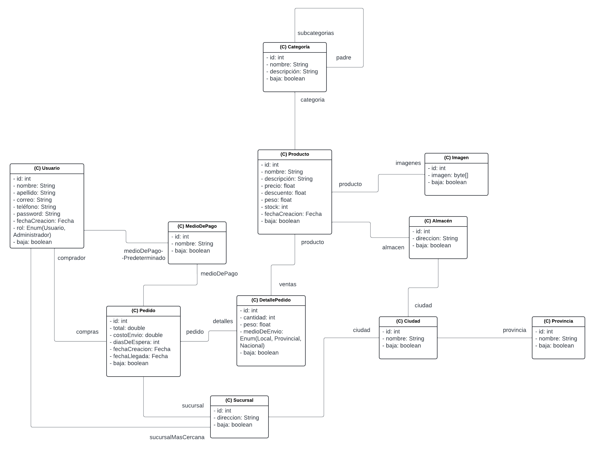
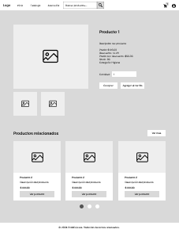
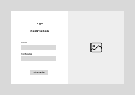
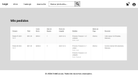
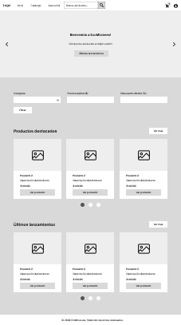
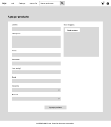
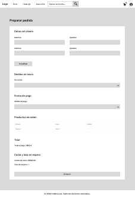
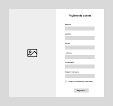

# docs/dp-iteracion-1.md

## Trabajo en equipo

- *Joaquín Kuster:* Desarrollo del backend, incluyendo la lógica de negocio y los servicios para las funcionalidades.  
- *Lázaro Martínez:* Desarrollo del frontend, diseño de la interfaz y validaciones de formularios.  
- *Liam Bialy:* Desarrollo del frontend, diseño de la interfaz y validaciones de formularios.  

---

## Diseño OO

*Diagrama de clases UML:*  

---

## Wireframe y Caso de Uso

- *Wireframe:*  
  Boceto simple de:
  - Página de detalles del producto.  
    
  - Página de inicio de sesión y registro.  
    
  - Página de visualización de pedidos del cliente.  
    
  - Página de inicio.  
    
  - Página de agregar producto.  
    
  - Página de preparar pedido.  
    
  - Página de registro.  
    

- *Caso de Uso:*

  ### Caso de Uso 1: Comprar producto individual
  **Actores:** Cliente  
  **Propósito:** Permite a los clientes comprar productos individuales de manera rápida y sencilla, el sistema debe calcular el precio con descuento y mostrar los detalles antes de realizar la compra.  
  **Precondición:** El cliente ha iniciado sesión en el sistema.  
  **Postcondición:** El producto ha sido comprado y el stock ha sido actualizado.  

  ### Caso de Uso 2: Calcular precio con descuento
  **Actores:** Cliente  
  **Propósito:** Permite que el sistema calcule automáticamente el precio del producto con descuento para que el cliente pueda conocer cuánto debe pagar.  
  **Precondición:** El cliente ha seleccionado un producto para la compra.  
  **Postcondición:** El precio con descuento es mostrado al cliente en la vista del producto.  

  ### Caso de Uso 3: Iniciar sesión o registrar una cuenta
  **Actores:** Usuario  
  **Propósito:** Permite a los usuarios acceder al sistema mediante un inicio de sesión o registro de cuenta.  
  **Precondición:** El usuario tiene una cuenta en el sistema o está dispuesto a crear una.  
  **Postcondición:** El usuario puede acceder a su cuenta o se ha creado una nueva cuenta en el sistema.  

  ### Caso de Uso 4: Calcular envío y tiempo de espera
  **Actores:** Cliente  
  **Propósito:** Calcula el costo de envío y el tiempo de espera en función del destino y el tipo de envío seleccionado.  
  **Precondición:** El cliente ha añadido un producto al carrito y ha seleccionado la sucursal de destino.  
  **Postcondición:** El sistema ha calculado y mostrado el costo de envío y el tiempo estimado.  

  ### Caso de Uso 5: Alta de nuevos productos
  **Actores:** Administrador  
  **Propósito:** Permite a los administradores añadir nuevos productos al sistema para mantener actualizado el catálogo.  
  **Precondición:** El administrador está autenticado y tiene acceso a la sección de alta de productos.  
  **Postcondición:** El nuevo producto es registrado y aparece en el catálogo disponible para los clientes.  

  ### Caso de Uso 6: Modificar perfil del cliente
  **Actores:** Cliente  
  **Propósito:** Permite al cliente actualizar su información personal, incluyendo la contraseña.  
  **Precondición:** El cliente ha iniciado sesión en su cuenta.  
  **Postcondición:** Los datos del cliente han sido actualizados correctamente.  

  ### Caso de Uso 7: Ver pedidos del cliente
  **Actores:** Cliente  
  **Propósito:** Permite al cliente ver el historial de pedidos realizados y sus detalles.  
  **Precondición:** El cliente ha realizado al menos un pedido en el sistema.  
  **Postcondición:** El cliente puede ver el detalle de cada pedido, incluyendo productos, precios, y costos de envío.  

  ### Caso de Uso 8: Seleccionar sucursal y medio de pago
  **Actores:** Cliente  
  **Propósito:** Permite al cliente seleccionar una sucursal y un medio de pago durante el proceso de compra.  
  **Precondición:** El cliente ha añadido productos al carrito y está listo para finalizar la compra.  
  **Postcondición:** La compra se realiza con los datos correctos de sucursal y medio de pago.  

  ### Caso de Uso 9: Ver detalles de un producto
  **Actores:** Cliente  
  **Propósito:** Muestra información detallada de un producto para que el cliente tome una decisión de compra informada.  
  **Precondición:** El cliente ha seleccionado un producto en la tienda.  
  **Postcondición:** El cliente puede ver la información del producto y agregarlo al carrito de compras.  

  ### Caso de Uso 10: Ver página principal
  **Actores:** Usuario  
  **Propósito:** Permite a los usuarios visualizar todos los productos disponibles en el sistema.  
  **Precondición:** El usuario accede a la página principal de la tienda.  
  **Postcondición:** El sistema muestra todos los productos disponibles para que el cliente los explore.  

  ### Caso de Uso 11: Agregar un nuevo producto
  **Actores:** Administrador  
  **Propósito:** Permite al administrador agregar un nuevo producto al sistema ingresando datos como nombre, precio, stock, etc.  
  **Precondición:** El administrador ha iniciado sesión y tiene acceso a la sección de alta de productos.  
  **Postcondición:** El producto se ha registrado correctamente en el sistema y está disponible para su compra.  

  ### Caso de Uso 12: Comprar un pedido
  **Actores:** Cliente  
  **Propósito:** Permite al cliente realizar una compra, seleccionar sucursal, y elegir un método de pago.  
  **Precondición:** El cliente ha añadido productos al carrito y está listo para realizar el pedido.  
  **Postcondición:** El pedido se ha realizado correctamente y el sistema calcula el costo total, el costo de envío y el tiempo estimado de entrega.  

---

## Backlog de Iteración

### Historias de usuario implementadas en la iteración 1:

#### **HU1: Compra individual de un producto**
**Descripción de la historia de usuario**  
Como cliente,  
Quiero poder comprar un producto individual  
Para realizar una compra rápida y sencilla.
**Criterios de aceptación**  
Listado:
- El cliente debe seleccionar un producto de la vista.
- El sistema debe mostrar el precio actualizado con descuentos (si aplica).
- Al confirmar la compra, se debe restar la cantidad comprada del stock.

#### **HU2: Calcular el precio de un producto con descuento**
**Descripción de la historia de usuario**  
Como cliente,  
Quiero que el sistema calcule automáticamente el precio del producto con descuento  
Para saber cuánto debo pagar.
**Criterios de aceptación**  
Listado:
- El descuento debe aplicarse automáticamente al precio del producto.
- El precio final debe mostrarse en la vista del producto y en el carrito.

#### **HU3: Inicio de sesión y registro de cuenta**
**Descripción de la historia de usuario**  
Como usuario,  
Quiero iniciar sesión o registrar una nueva cuenta  
Para acceder al sistema y personalizar mi experiencia.
**Criterios de aceptación**  
Listado:
- El sistema debe validar campos en el formulario de registro.
- El inicio de sesión debe requerir correo y contraseña válidos.
- La cuenta debe almacenarse en el sistema con datos básicos del usuario.

#### **HU4: Cálculo del envío y días de espera**
**Descripción de la historia de usuario**  
Como cliente,  
Quiero saber el costo y tiempo de envío según el destino y tipo de envío  
Para saber cuándo y cuánto me costará recibir mis productos.
**Criterios de aceptación**  
Listado:
- El sistema debe calcular el envío según si es local, provincial o nacional.
- Si más de un producto sale de la misma ciudad, el costo de envío debe unificarse.
- El cálculo debe incluir días estimados de espera.

#### **HU5: Alta de nuevos productos como administrador**
**Descripción de la historia de usuario**  
Como administrador,  
Quiero dar de alta nuevos productos en el sistema  
Para mantener actualizado el catálogo de la tienda.
**Criterios de aceptación**  
Listado:
- El formulario debe validar campos obligatorios como nombre, precio y stock.
- El producto debe asignarse a una categoría y almacén específico.
- Al registrarse, el producto debe ser visible en el catálogo.

#### **HU6: Modificar perfil del cliente**
**Descripción de la historia de usuario**  
Como cliente,  
Quiero modificar mis datos personales y mi contraseña  
Para mantener mi perfil actualizado y seguro.
**Criterios de aceptación**  
Listado:
- El cliente debe poder actualizar nombre, apellido, correo y teléfono.
- El cliente debe poder cambiar su contraseña con validación de la actual.

#### **HU7: Ver pedidos como cliente**
**Descripción de la historia de usuario**  
Como cliente,  
Quiero ver los pedidos que he hecho y sus detalles  
Para tener un registro de mis compras.
**Criterios de aceptación**  
Listado:
- El cliente debe poder ver una lista de pedidos realizados.
- Cada pedido debe mostrar detalles como productos, precios, envío y coste.

#### **HU8: Incorporación de sucursales y medios de pago**
**Descripción de la historia de usuario**  
Como cliente,  
Quiero poder seleccionar una sucursal y un medio de pago durante mi compra  
Para que mi experiencia sea completa y flexible.
**Criterios de aceptación**  
Listado:
- El cliente debe elegir la sucursal donde recoger el pedido o a la que será enviado.
- El cliente debe seleccionar un medio de pago compatible (efectivo, tarjeta, etc.).

#### **HU9: Vista de detalles del producto**
**Descripción de la historia de usuario**  
Como cliente,  
Quiero ver una página detallada del producto  
Para conocer todas sus características antes de comprar.
**Criterios de aceptación**  
Listado:
- La vista debe incluir el nombre, precio, descuento, descripción, y stock disponible.
- La página debe mostrar imágenes del producto y opciones para añadir al carrito.
- El sistema debe ser capaz de calcular y mostrar en pantalla el precio con descuento.
- El cliente puede comprar por cantidad dependiendo del stock disponible.
- El cliente puede agregar al carrito dependiendo del stock disponible.
- El cliente puede acceder a los productos relacionados con el producto que quiere comprar.

#### **HU10: Vista de la página principal**
**Descripción de la historia de usuario**  
Como usuario,  
Quiero poder visualizar todos los productos disponibles  
Para poder acceder a los detalles de cada producto que se muestre en el sistema.
**Criterios de aceptación**  
Listado:
- El sistema debe ser capaz de mostrar todos los productos que se han cargado.

#### **HU11: Vista del formulario para agregar un nuevo producto**
**Descripción de la historia de usuario**  
Como administrador,  
Quiero publicar un nuevo producto en el sistema, agregando los siguientes datos:  
Nombre del producto, Descripción, Precio, Descuento (%), Peso (en Kg), Stock, Categoría, Almacén y subir una imagen asociada al producto.
**Criterios de aceptación**  
Listado:
- El sistema debe validar los datos ingresados por el administrador.
- El sistema debe ser capaz de almacenar fotos en la base de datos.

#### **HU12: Vista del formulario para comprar un pedido**
**Descripción de la historia de usuario**  
Como usuario,  
Quiero tener una sección donde pueda realizar una transacción para el producto que quiero comprar.  
Quiero poder actualizar mis datos de forma sencilla si es necesario.  
Quiero poder seleccionar una sucursal.  
Quiero poder seleccionar un método de pago.
**Criterios de aceptación**  
Listado:
- El sistema debe ser capaz de mostrar en el formulario los productos a ordenar con nombre, precio y cantidad.
- El sistema debe ser capaz de calcular la suma total en pesos.
- El sistema debe ser capaz de calcular el costo de envío.
- El sistema debe ser capaz de calcular los días que tardará en llegar dependiendo de la distancia del cliente a la sucursal.

---

## Tareas
1. Backend:
   - Implementar lógica de compra individual.
   - Crear cálculo automático de descuentos.
   - Configurar servicios para el manejo de sucursales y métodos de pago.
   - Desarrollar endpoints para iniciar sesión, registrar cuentas y ver pedidos.

2. Frontend:
   - Diseñar página de detalles del producto con cálculo de descuentos.
   - Crear formularios de inicio de sesión, registro y modificación de perfil.
   - Implementar la visualización de pedidos del cliente.
   - Diseñar interfaz para el alta de nuevos productos.

3. Validaciones:
   - Validar formularios de registro y modificación de perfil.
   - Verificar que los datos de envío y métodos de pago sean correctos.
   - Actualizar stock tras realizar una compra.

---