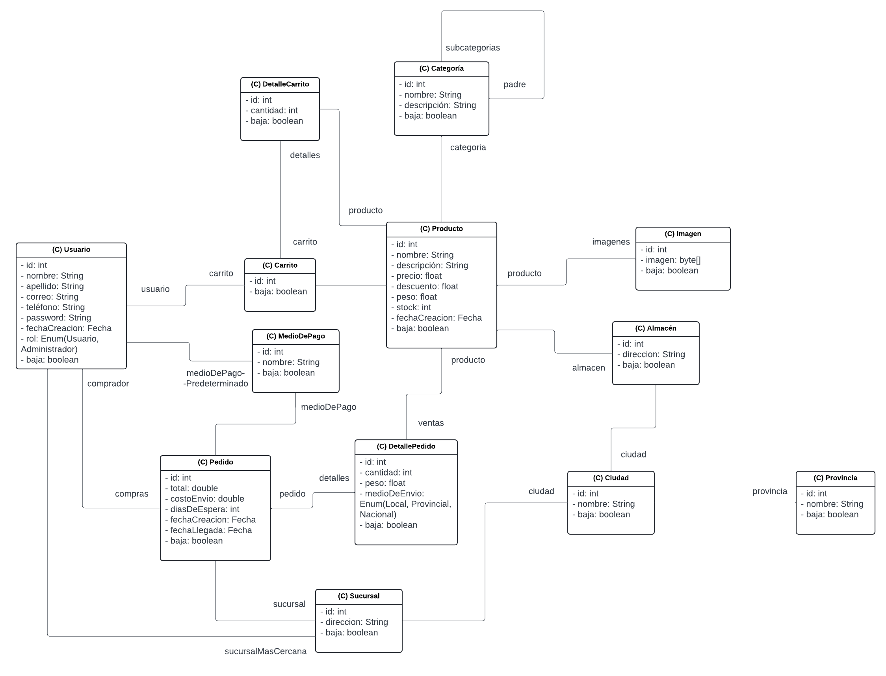
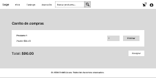
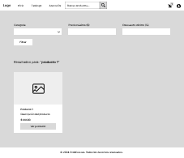
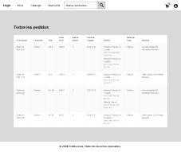

# docs/dp-iteracion-2.md

## Trabajo en equipo

- *Joaquín Kuster:* Desarrollo del backend, incluyendo la lógica de negocio para el carrito de compras y la gestión de pedidos.
- *Lázaro Martínez:* Desarrollo del frontend, diseño de la interfaz y validaciones de formularios.
- *Liam Bialy:* Desarrollo del frontend, diseño de la interfaz y validaciones de formularios.

---

## Diseño OO

*Diagrama de clases UML:*  

---

## Wireframe y Caso de Uso

- *Wireframe:*  
  Boceto simple de:
  - Carrito de compras con productos seleccionados.  
    
  - Página de búsqueda de productos.  
    
  - Páginas de administración para ver pedidos.  
    

- *Caso de Uso:*  

  ### Caso de Uso 1: Compra por paquetes de varios productos (Carrito de compras)  
  **Actores:** Cliente  
  **Propósito:** Permite al cliente agregar varios productos al carrito y completar la compra en una sola transacción, optimizando el proceso de compra.  
  **Precondición:** El cliente debe haber seleccionado al menos un producto en la tienda.  
  **Postcondición:** El cliente ha completado la compra y el stock de los productos se ha actualizado.  

  ### Caso de Uso 2: Buscador de productos  
  **Actores:** Cliente  
  **Propósito:** Permite al cliente buscar productos filtrados por categorías, precio y descuento, facilitando la búsqueda de productos específicos.  
  **Precondición:** El cliente debe estar en la página de búsqueda de productos.  
  **Postcondición:** El cliente ve los productos filtrados según los criterios seleccionados.  

  ### Caso de Uso 3: Ver pedidos como administrador  
  **Actores:** Administrador  
  **Propósito:** Permite al administrador ver todos los pedidos realizados hasta la fecha, con detalles completos de cada uno.  
  **Precondición:** El administrador debe haber iniciado sesión en el sistema.  
  **Postcondición:** El administrador tiene acceso a una lista completa de pedidos, con detalles de productos, cliente, envío y coste.  

  ### Caso de Uso 4: Búsqueda de productos destacados  
  **Actores:** Cliente  
  **Propósito:** Permite al cliente ver productos destacados según el número de ventas, ayudándole a conocer los más populares.  
  **Precondición:** El cliente debe estar en la página de búsqueda de productos destacados.  
  **Postcondición:** El cliente ve una lista de productos destacados, con sus detalles básicos y ventas acumuladas.  

  ### Caso de Uso 5: Validaciones en formularios clave  
  **Actores:** Cliente, Administrador  
  **Propósito:** Permite validar correctamente los formularios de registro, alta de productos y carrito para evitar errores e inconsistencias.  
  **Precondición:** El cliente o administrador debe estar completando un formulario en el sistema (registro, alta de producto o carrito).  
  **Postcondición:** El sistema ha validado correctamente los datos y ha permitido proceder con el envío del formulario.

---

## Backlog de Iteración

### Historias de usuario implementadas en la iteración 2:

#### **HU1: Compra por paquetes de varios productos (Carrito de compras)**  
**Descripción de la historia de usuario**  
Como cliente,  
Quiero agregar varios productos al carrito y comprar en una sola transacción  
Para optimizar mi tiempo de compra.
**Criterios de aceptación**  
Listado:
- Los productos deben poder añadirse o eliminarse del carrito.
- El sistema debe verificar si hay suficiente stock al añadir un producto.
- Al completar la compra, el stock de cada producto debe actualizarse.

#### **HU2: Buscador de productos**  
**Descripción de la historia de usuario**  
Como cliente,  
Quiero buscar productos aplicando filtros por categoría, precio y descuento  
Para encontrar fácilmente lo que necesito.
**Criterios de aceptación**  
Listado:
- El buscador debe permitir filtrar por categorías disponibles.
- El buscador debe permitir filtrar hasta un precio específico.
- El buscador debe permitir filtrar desde un cierto descuento.

#### **HU3: Ver pedidos como administrador**  
**Descripción de la historia de usuario**  
Como administrador,  
Quiero ver todos los pedidos realizados hasta ahora  
Para gestionar el flujo de ventas de la tienda.
**Criterios de aceptación**  
Listado:
- El administrador debe acceder a una vista de todos los pedidos.
- Cada pedido debe mostrar detalles como productos, cliente, envío y coste.

#### **HU4: Búsqueda de productos destacados**  
**Descripción de la historia de usuario**  
Como cliente,  
Quiero buscar productos destacados en base a sus ventas  
Para conocer los productos más populares.
**Criterios de aceptación**  
Listado:
- Los productos destacados deben mostrarse según el número de ventas acumuladas.
- La vista debe ser fácil de navegar y mostrar detalles básicos de cada producto.

#### **HU5: Validaciones en formularios clave**  
**Descripción de la historia de usuario**  
Como desarrollador,  
Quiero validar los formularios de registro, alta de productos y carrito  
Para evitar errores o inconsistencias en el sistema.
**Criterios de aceptación**  
Listado:
- El formulario de registro debe validar campos como nombre, correo y contraseña.
- El formulario de alta de productos debe validar nombre, precio, categoría y stock.
- El carrito debe verificar que los productos seleccionados tienen suficiente stock.

#### **HU6: Diseñar varias vistas y elementos clave de la interfaz**  
**Descripción de la historia de usuario**  
Como diseñador,  
Quiero desarrollar componentes visuales como la barra de navegación, el inicio, el carrito y el perfil  
Para ofrecer una experiencia de usuario intuitiva y atractiva.
**Criterios de aceptación**  
Listado:
- La barra de navegación debe incluir acceso rápido a categorías, carrito y perfil.
- El inicio debe tener un hero, filtros, y secciones para productos destacados y últimos lanzamientos.
- El perfil debe permitir la edición de datos personales y contraseña.
- El carrito debe mostrar productos, cantidades y el precio total actualizado.

---

## Tareas
1. Backend:
   - Implementar funcionalidad para agregar productos al carrito de compras.
   - Desarrollar la lógica de cálculo de precios en el carrito, aplicando descuentos.
   - Implementar el sistema de búsqueda de productos.
   - Crear endpoints para que el administrador vea todos los pedidos.
   - Implementar validación en los formularios clave.

2. Frontend:
   - Diseñar y mostrar el carrito de compras con opción de agregar o eliminar productos.
   - Crear la interfaz para la búsqueda de productos y visualización de productos destacados.
   - Desarrollar la vista para que los administradores puedan ver los pedidos.
   - Crear validaciones visuales en los formularios clave para registro y compra.

3. Validaciones:
   - Asegurar que todos los formularios clave sean validados correctamente antes de ser enviados.
   - Verificar el correcto funcionamiento del carrito de compras con la cantidad de productos y descuentos aplicados.
   - Validar que los productos añadidos al carrito sean actualizados correctamente al modificar cantidades.

---